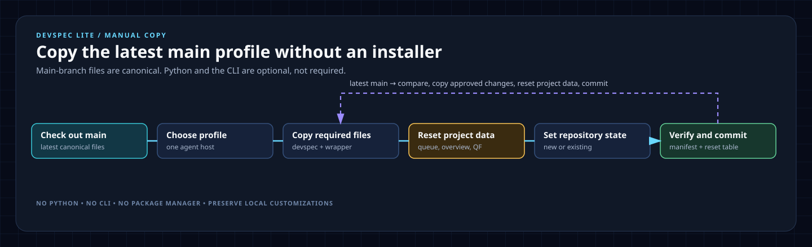

# Manual installation

Use this route when a developer does not want to install Python, UV, WinGet, Homebrew, or the Devspec Lite CLI. It copies the latest canonical files from the `main` branch.

## 1. Check out `main`

Clone the repository at its latest `main` branch:

```powershell
git clone --depth 1 --branch main https://github.com/speclabs/devspec-lite.git
```

The `main` checkout supplies the canonical `devspec/` directory and prebuilt agent-profile wrappers. No workflow content is generated during manual setup; repository state is target-specific setup metadata.

## 2. Copy one profile

Copy `devspec/` and the folder or file for the agent host into the target repository.

| Profile | Copy from the `main` checkout | Copy into the target repository |
|---|---|---|
| Copilot | `devspec/`, `.github/` | `devspec/`, `.github/` |
| Codex | `devspec/`, `AGENTS.md` | `devspec/`, `AGENTS.md` |
| Claude | `devspec/`, `.claude/` | `devspec/`, `.claude/` |
| Cursor | `devspec/`, `.cursor/` | `devspec/`, `.cursor/` |
| Gemini | `devspec/`, `.gemini/` | `devspec/`, `.gemini/` |
| Antigravity | `devspec/`, `.agents/` | `devspec/`, `.agents/` |

Do not pre-copy individual foundation or work-item templates. When an agent needs a missing target artifact, the shared `work` protocol creates it from the matching `_template`; creating a work item initializes every file in `devspec/work-items/_template`, including `meta.md`.

The `main` checkout also carries Devspec Lite's own project records, which the CLI never installs. After copying, reset these in the target so it starts empty:

| Path | Action in the target repository |
|---|---|
| `devspec/architecture/artifact-queue.md` | Replace with `devspec/architecture/_template/artifact-queue.md` |
| `devspec/architecture/overview.md` | Replace with `devspec/architecture/_template/overview.md` |
| `devspec/quickfixes/QF-*.md` | Delete; keep `README.md` and `_template.md` |
| `devspec/foundation/repository-state.md` | Replace as described in step 3 |

## 3. Set the target repository state

After copying `devspec/`, replace `devspec/foundation/repository-state.md` with the state that matches the target repository. Do not retain the state from the `main` checkout.

| Target repository | File contents |
|---|---|
| Existing source code | `State: existing` and `Start with: devspec.extract` |
| New or empty repository | `State: new` and `Start with: devspec.projectcontext` |

Use this exact Markdown structure:

```text
# Repository State

- State: <existing|new>
- Start with: `devspec.<extract|projectcontext>`
```

## Manual-copy lifecycle



## 4. Verify and commit

Verify that every path listed in `devspec/install-manifest.txt` exists, that the selected agent wrapper is present, that `devspec/foundation/repository-state.md` has the target's intended state and start command, and that every row in step 2's reset table has been applied. Compare any same-named target wrapper before replacing it, then commit the copied files with the target repository.

## 5. Update manually

Pull the latest `main` branch, or make a fresh `main` checkout. Compare the incoming files with the target repository, copy the approved changes, preserve local customizations, and retain the target's own `repository-state.md`. The CLI `doctor`, `init`, and package-manager upgrade paths are optional alternatives; they are not prerequisites for manual setup.
