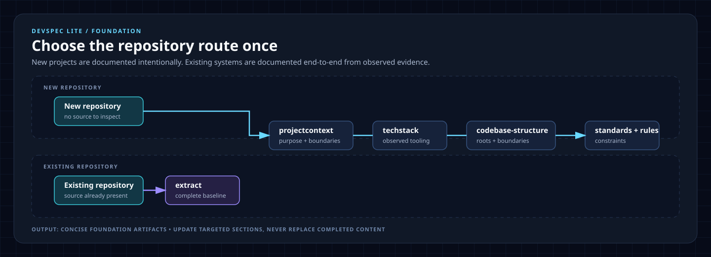
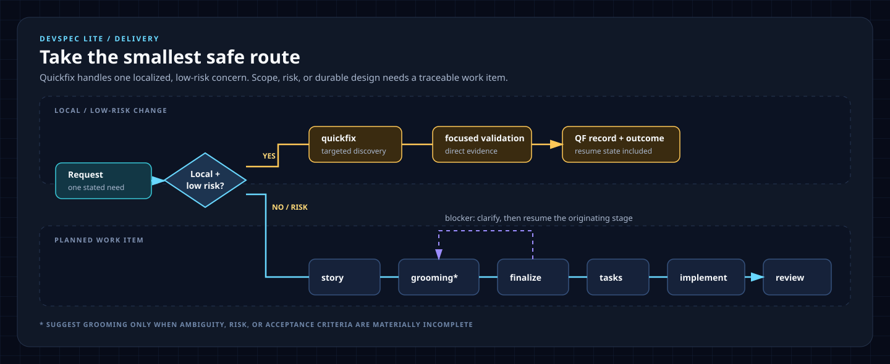

# CLI quick start

Use this guide after choosing a CLI installation route. For a no-installer workflow, use [manual copy from `main`](manual-copy.md) instead.

## 1. Initialize and validate

Choose the repository state that matches the target:

```powershell
# New repository: no source code to inspect
uvx devspec init --target . --profile all --repo-state new
uvx devspec doctor --target . --profile all

# Existing repository: source code is already present
uvx devspec init --target . --profile all --repo-state existing
uvx devspec doctor --target . --profile all
```

`all` installs every supported wrapper. Use `copilot`, `codex`, `claude`, `cursor`, `gemini`, or `antigravity` when the repository uses only that agent host.

## 2. Start the right workflow

Every `devspec.*` command begins by confirming repository scope: it asks for each repository path, then one named access requirement per repository. Answer those before the command inspects any source. The route itself comes from `devspec/foundation/repository-state.md`, which `init` writes from `--repo-state`.

- New repository: author the foundation intentionally with `devspec.projectcontext → devspec.techstack → devspec.codebase-structure → devspec.coding-standards → devspec.rules`.
- Existing repository: run `devspec.extract` once. It creates the evidence-backed technical, business, workflow, and rule baseline, then asks whether to generate all the candidate diagrams, none, or a chosen subset. Any candidate left in the queue can be generated later with `/devspec.diagram DIA-002`, or `/devspec.diagram DIA-002 motion=explain` for an evidence-backed animated sequence.

Work route: `devspec.story → devspec.refine → devspec.finalize → devspec.tasks → devspec.implement → devspec.review`. Every work item goes through refinement after intake, even when the source carried acceptance criteria.

When a command reports a blocker, run `devspec.clarify`: it resolves the one recorded decision and resumes the exact saved command. When a related requirement arrives after finalization, run `devspec.changerequest` to append it, then refine and re-finalize the new scope revision.

Use `devspec.quickfix` only for one localized, low-risk change. It routes API contracts, migrations, authentication/security, and breaking changes to the full route.

## Workflow routes





For scenarios and examples, see the [developer workflow guide](workflows.md).

## Setup routes

- [Manual copy from `main`](manual-copy.md)
- [Python and uvx](setup-python.md)
- [WinGet](setup-winget.md)
- [Homebrew](setup-homebrew.md)
- [CLI lifecycle](setup-lifecycle.md)
