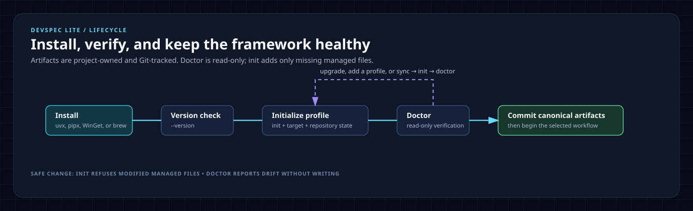

# CLI lifecycle

Use this guide only after installing the Devspec Lite CLI through `uvx`, `pipx`, WinGet, or Homebrew. It covers CLI initialization, validation, upgrades, canonical-artifact synchronization, and profile changes. Manual copying has its own [manual-copy lifecycle](manual-copy.md) and does not require this CLI flow.

## Lifecycle at a glance



The terminal CLI is `devspec`. After initialization, the installed agent wrappers expose the `devspec.*` workflow commands. They are intentionally different interfaces.

## Command map

| Goal | Use | Notes |
|---|---|---|
| Install the CLI | `uvx`, `pipx`, WinGet, or Homebrew | Choose one package-manager route below. |
| Check version | `devspec --version` | Confirms the installed CLI. |
| Initialize | `devspec init --target <path> --profile <profile> --repo-state <new\|existing>` | Copies canonical artifacts and selected wrappers. |
| Validate | `devspec doctor --target <path> --profile <profile>` | Read-only check of contracts, protocols, templates, and wrappers. |
| Compare installed framework files | `devspec diff --target <path>` | Read-only drift report. |
| Synchronize canonical artifacts | `devspec sync --target <path> --profile <profile> --dry-run` | Preview, then run without `--dry-run`; use `--force` only for reviewed framework-owned edits. |
| Run delivery work | Agent command such as `devspec.story` or `devspec.quickfix` | Use after initialization; see the [workflow guide](workflows.md). |

`devspec upgrade` is not a CLI command; upgrade the package with its package manager, then use `diff` and `sync` to update the installed framework files.

## 1. Install Devspec Lite

Choose one supported CLI route:

| Platform or preference | Example |
|---|---|
| One-off, any OS | `uvx devspec --help` |
| Persistent Python install | `pipx install devspec` |
| Windows package manager | `winget install --id SpecLabs.Devspec --exact` |
| Homebrew tap | `brew tap speclabs/devspec-lite && brew install devspec` |

For a no-installer setup, use [manual copy from `main`](manual-copy.md).

## 2. Initialize a repository

Use `existing` when source code already exists:

```powershell
devspec init --target D:\Code\orders --profile all --repo-state existing
devspec doctor --target D:\Code\orders --profile all
```

Use `new` before the first foundation workflow in a blank repository:

```powershell
devspec init --target D:\Code\orders --profile copilot --repo-state new
devspec doctor --target D:\Code\orders --profile copilot
```

`all` installs every supported wrapper. Use one of `copilot`, `codex`, `claude`, `cursor`, `gemini`, or `antigravity` when the repository uses only that agent.

## 3. Validate the CLI installation

Run Doctor after CLI initialization, after an upgrade, and before reporting a CLI setup problem:

```powershell
devspec doctor --target D:\Code\orders --profile all
```

Doctor checks that each canonical contract, XML protocol, and selected adapter wrapper exists and that wrappers point to their matching contract. It does not modify repository code.

## 4. Upgrade the CLI

Upgrade using the same installation method:

```powershell
# uvx: use the latest package for the next command
uvx devspec@latest --help

# pipx
pipx upgrade devspec

# WinGet
winget upgrade --id SpecLabs.Devspec --exact

# Homebrew
brew upgrade devspec
```

After upgrading, synchronize and validate the target repository.

## 5. Compare and synchronize canonical framework files

Preview the exact upgrade first, then apply it:

```powershell
devspec diff --target D:\Code\orders
devspec sync --target D:\Code\orders --profile all --dry-run
devspec sync --target D:\Code\orders --profile all
devspec doctor --target D:\Code\orders --profile all
```

`sync` adds missing files and replaces packaged files that have not been locally edited. It never overwrites a locally modified framework-owned file unless `--force` is supplied, never overwrites project-owned artifacts, and never deletes retained obsolete wrappers. Use `--force` only after reviewing `diff`.

## 6. Change or add a profile

To add Codex to a repository that already has the Copilot profile:

```powershell
devspec init --target D:\Code\orders --profile codex --repo-state existing
devspec doctor --target D:\Code\orders --profile codex
```

To add every remaining wrapper, use `all`:

```powershell
devspec init --target D:\Code\orders --profile all --repo-state existing
devspec doctor --target D:\Code\orders --profile all
```

Changing to a narrower profile does not delete wrappers from other agents. Review and remove obsolete wrapper folders manually only after confirming no team member needs them.

## 7. Start using the workflow

For a new repository, start with `devspec.projectcontext`. For an existing repository, start with `devspec.extract`. Then follow the route in [the workflow guide](workflows.md). Use `devspec.quickfix` only for one localized, low-risk change.