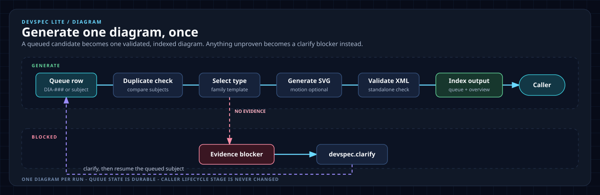

# Developer workflow routes

Use the smallest route that preserves a durable, reviewable record. Git-tracked canonical `devspec/` artifacts are the source of truth; chat history is only supporting context.

## 1. Establish project foundation

- New repository: start with `devspec.projectcontext`.
- Before every command, confirm the single-repository or multi-repository scope, including the scaffold location and each source repository's role, path, and permissions, unless current canonical evidence records it. The current workspace alone is not proof of scope.
- Existing repository: run `devspec.extract` once with confirmed scope. It completes the evidence-backed technical, workflow, and rule baseline, prepares the applicable diagram list, and asks whether to generate all, selected, or no diagrams. A prepared item can later be generated with `/devspec.diagram DIA-###`; do not rerun individual foundation commands afterward.
- New repository: run `devspec.projectcontext`, `devspec.techstack`, `devspec.codebase-structure`, `devspec.coding-standards`, and `devspec.rules` in order. `devspec.techstack`, `devspec.codebase-structure`, and `devspec.coding-standards` inspect source for evidence, so they confirm repository access first; the other two are input-driven. `devspec.diagram` is not part of the chain; call it separately and it returns to its caller.

## 2. Deliver a change

Use `devspec.quickfix` only when the request is one localized enhancement or bug fix with one primary scope. Examples: a UI copy correction, focused test adjustment, or local configuration fix.

Use the work-item route for public contracts, data migrations, authentication/security work, breaking changes, unresolved risk, or multiple concerns. Every work item goes through refinement after intake, even when the source carried acceptance criteria, because intake does not read the code. If finalization finds an open or new requirement gap, it returns the work item to `refine` instead of recording a blocker. `clarify` asks one interactive material blocker question, records the decision, and resumes the originating stage.

Every command validates its declared entry state and records one explicit transition in the canonical artifact. Work items use a monotonic `scope_revision`; a related change request increments it, retains older finalization, task, implementation, and review evidence as superseded history, and requires a new finalization. Review accepts only a matching revision and changed-work baseline; accepted work is terminal, rework reopens only the tasks a finding names, and blocked work routes through `clarify`.

After `devspec.story` selects a work item, continue with `devspec.refine`, `devspec.finalize`, `devspec.tasks`, `devspec.implement`, `devspec.review`, `devspec.clarify`, or `devspec.changerequest` without an ID. The private per-worktree selection resolves the current story only when it matches the branch and `meta.md`; `continue` dispatches only its recorded `next` action. Provide an ID to switch stories. If several active stories are eligible, Devspec asks you to choose rather than inferring.

A material decision is work-item-local unless it applies beyond that story. At finalization, promote a reusable business or validation decision to `foundation/workflow-rules.md` with a stable rule ID; promote a reusable engineering constraint to `foundation/rules.md`. New stories read only relevant foundation rules and the affected code area, not every historic decision file. Code and tests are the primary enforcement; add a developer comment only for non-obvious rationale and cite the canonical rule ID.

Every project maintains one OWASP Top 10:2025 baseline in `foundation/rules.md`. Finalization cites only the relevant coding standards, codebase boundaries, and OWASP controls; implementation records targeted tests and available project-native security evidence. A developer may propose a false-positive or not-applicable finding, but it is accepted only after the reviewer confirms the developer's rationale and enforceable evidence. “Internal-only”, authenticated-only, or limited access is not enough by itself; a configuration, network, deployment, or access-control proof is required. Revalidate any confirmed exception after a material change to its code, access, deployment, integration, or exposure.

## 3. Install and maintain the framework

## 4. Generate one diagram

For an evidence-backed architecture or workflow visual, choose a pattern from the [diagram type guide](../devspec/architecture/_template/diagram-types.md). That guide maps each of the eleven diagram types to its own SVG family template in `devspec/architecture/_template/`; start the SVG from the template it names.

For the record that accompanies a diagram, use the compact [diagram record sample](../devspec/architecture/_template/diagram-sample.md) and its worked [SVG sample](../devspec/architecture/_template/diagram-sample.svg). The opt-in [motion sample](../devspec/architecture/_template/diagram-motion-sample.svg) shows the animation pattern, and the [HTML presentation sample](../devspec/architecture/_template/diagram-sample.html) shows the optional presentation shell.

Assign a stable `DIA-###` ID, keep status in the queue, and add only completed diagram links to the overview index.

Diagram output defaults to static SVG with `motion=none`. Use `/devspec.diagram DIA-### motion=explain` when a confirmed sequence, flow, or state transition benefits from motion. The queue records `svg; motion=explain`; the animation must be finite, preserve a complete static final frame, and expose the same information when reduced motion is enabled. Request HTML separately when its presentation shell is needed.

`init` is idempotent for unchanged managed files. It will not overwrite a changed contract or wrapper. For CLI-managed repositories, use `diff`, then `sync --dry-run`, followed by `sync` and `doctor` after an upgrade or profile addition. Manual-copy updates follow the [manual-copy guide](manual-copy.md). `sync` never deletes retained obsolete files.

## Examples

| Situation | Route |
|---|---|
| New service repository | `devspec.projectcontext → devspec.techstack → devspec.codebase-structure → devspec.coding-standards → devspec.rules` |
| Existing service with unknown conventions | `devspec.extract` — complete baseline extraction |
| Correct a known empty-state label | `devspec.quickfix` with `UI` scope |
| Add a customer-export API and authorization | `devspec.story → devspec.refine → devspec.finalize → devspec.tasks → devspec.implement → devspec.review` |
| A requirement is blocked by a data-retention decision | `devspec.clarify`, then resume the saved stage |
| Add a related requirement after finalization | `devspec.changerequest → devspec.refine → devspec.finalize → devspec.tasks → devspec.implement → devspec.review` |
